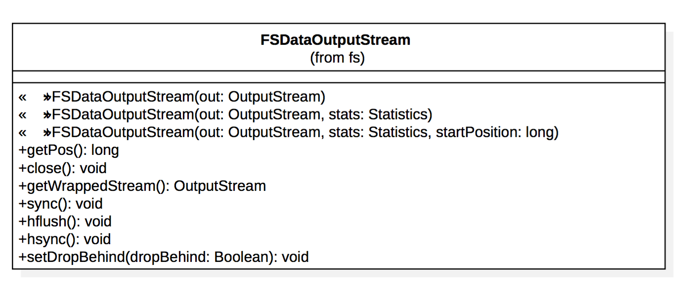
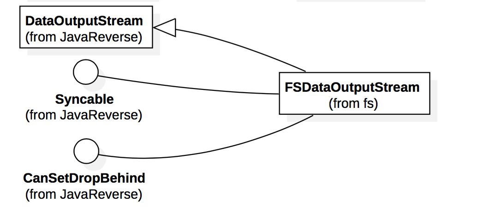
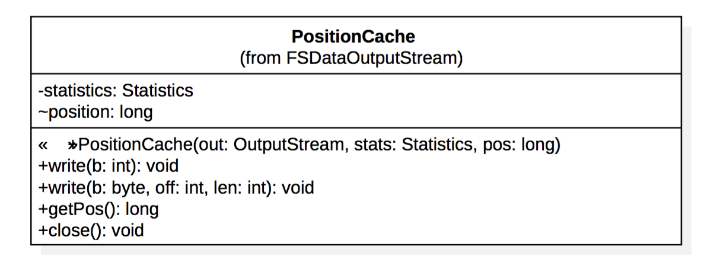
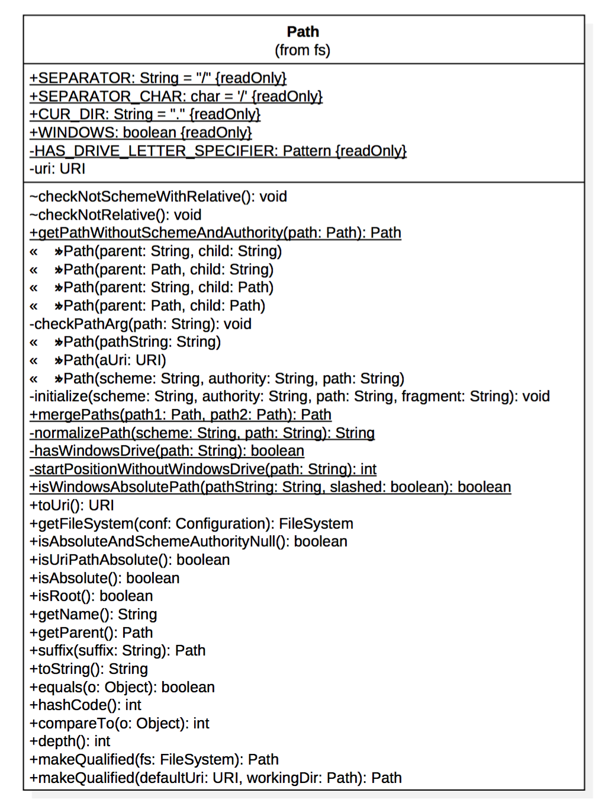
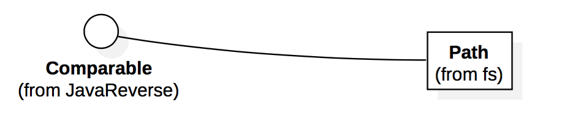
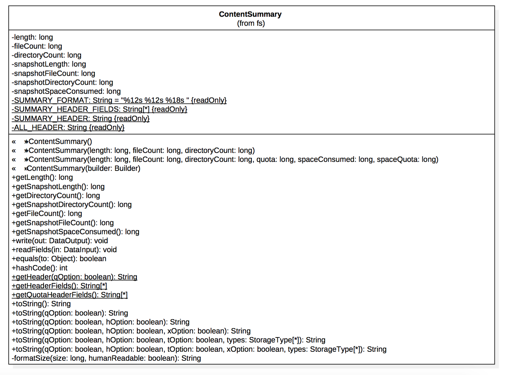
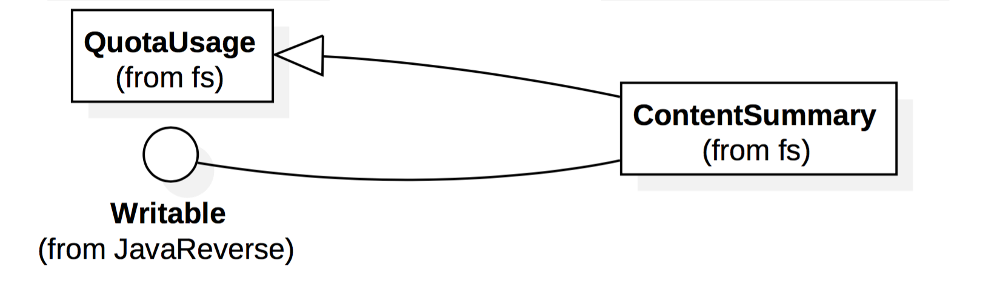
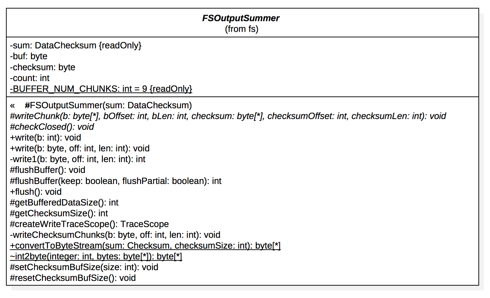
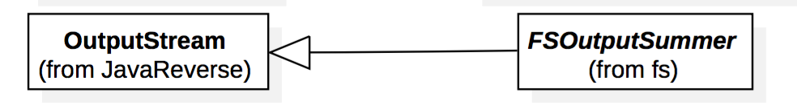

#hadoop源码分析
##FSDataOutputStream

Hadoop 的FileSystem中的create()方法返回了一个FSDataOutputStream对象。与FSDataInputStream一样，它也有一个用于查询位移的方法。但并没有类似于FSDataInputStream中seek()的方法，因为Hadoop不允许向流中的任意位置写数据，我们只能在一个文件的末尾处添加数据。同时2.8.0版本的Hadoop相较于旧版本，多实现了一个接口：CanSetDropBehind。

该接口声明了一个方法：

public void setDropBehind(Boolean dropBehind) throws IOException

用于判断流是否应该丢弃缓存。

FSDataOutputStream同样实现了getPos()的功能：

	 	  
public long getPos() throws IOException     

用于获取输入流的当前位置，并返回输入流的当前位置

继承关系： 

java.lang.Object -->

java.io.OutputStream -->

java.io.FilterOutputStream -->

java.io.DataOutputStream -->

org.apache.hadoop.fs.FSDataOutputStream

FSDataOutputStream继承自DataOutputStream 并实现了接口Syncable和接口CanSetDropBehind，下面是对该类的具体说明：
	
三个构造函数：

该构造函数已过时

	  @Deprecated
	  public FSDataOutputStream(OutputStream out) throws IOException {
	    this(out, null);
	  }

该构造函数的参数包括：OutputStream类型的参数，Statistics类的参数		

	  public FSDataOutputStream(OutputStream out, FileSystem.Statistics stats)
	    throws IOException {
	    this(out, stats, 0);
	  }
	
该构造函数的参数包括：OutputStream类型的参数，Statistics类的参数和当前流的开始位置。
		
	  public FSDataOutputStream(OutputStream out, FileSystem.Statistics stats,
	                            long startPosition) throws IOException {
	    super(new PositionCache(out, stats, startPosition));
	    wrappedStream = out;
	  }
	
获取输入流的当前位置，并返回输入流的当前位置	  
	  
    public long getPos() throws IOException {
      return position;                            
      // return cached position
    }
    
	public long getPos() throws IOException {
	return ((PositionCache)out).getPos();
	}

关闭基础输入流

	public void close() throws IOException {
	  out.close(); // This invokes PositionCache.close()
	}

刷新客户端中用户缓冲区的数据。在此调用的返回之后，新的读者将看到数据。来自于接口：Syncable

  	public void hflush() throws IOException {
    	if (wrappedStream instanceof Syncable) {
      	((Syncable)wrappedStream).hflush();
    	} else {
      		wrappedStream.flush();
    	}
  	}

将客户端用户缓冲区中的数据一直刷新到磁盘设备（但磁盘可能在其缓存中）。来自于接口：Syncable

  	public void hsync() throws IOException {
    	if (wrappedStream instanceof Syncable) {
      	((Syncable)wrappedStream).hsync();
    	} else {
      		wrappedStream.flush();
    	}
  	}

配置判断流是否应该丢弃缓存。

参数：dropBehind：判断是否删除缓存

	public void setDropBehind(Boolean dropBehind) throws IOException {
	  try {
	    ((CanSetDropBehind)wrappedStream).setDropBehind(dropBehind);
	  } catch (ClassCastException e) {
	    throw new UnsupportedOperationException("the wrapped stream does " +
	        "not support setting the drop-behind caching setting.");
	  }
	}

FSDataOutputStream 中有一个内部类 PositionCache,其从 FilterOutputStream 派生,提供了缓
存文件指针 position 的功能,并且有一个 statistics 属性,用来统计。

###接口：Syncable

	@InterfaceAudience.Public
	@InterfaceStability.Evolving
	public interface Syncable {
	  /**
	   * @deprecated As of HADOOP 0.21.0, replaced by hflush
	   * @see #hflush()
	   */
	  @Deprecated  public void sync() throws IOException;
	  
	  /** Flush out the data in client's user buffer. After the return of
	   * this call, new readers will see the data.
	   * @throws IOException if any error occurs
	   */
	  public void hflush() throws IOException;
	  
	  /** Similar to posix fsync, flush out the data in client's user buffer 
	   * all the way to the disk device (but the disk may have it in its cache).
	   * @throws IOException if error occurs
	   */
	  public void hsync() throws IOException;
	}
	
###接口：	CanSetDropBehind

	@InterfaceAudience.Public
	@InterfaceStability.Evolving
	public interface CanSetDropBehind {
	  /**
	   * Configure whether the stream should drop the cache.
	   *
	   * @param dropCache     Whether to drop the cache.  null means to use the
	   *                      default value.
	   * @throws IOException  If there was an error changing the dropBehind
	   *                      setting.
	   *         UnsupportedOperationException  If this stream doesn't support
	   *                                        setting the drop-behind.
	   */
	  public void setDropBehind(Boolean dropCache) 
	      throws IOException, UnsupportedOperationException;
	}
	

	
##Path

在一个FileSystem中命名一个文件或目录。路径字符串使用斜杠作为目录分隔符。

Path 对路径进行解析，将参数转换为标准的URI格式，对Path的参数作判断，标准化，字符化等操作。
继承关系：

java.lang.Object -->

org.apache.hadoop.fs.Path

构造函数
	
基于根据父路径解析的子路径创建新路径。

	public Path(String parent, String child) {
	  this(new Path(parent), new Path(child));
	}

基于根据父路径解析的子路径创建新路径。

	public Path(Path parent, String child) {
	  this(parent, new Path(child));
	}

基于根据父路径解析的子路径创建新路径。

	public Path(String parent, Path child) {
	  this(new Path(parent), child);
	}
	
基于根据父路径解析的子路径创建新路径。
	
	public Path(Path parent, Path child) {
	  // Add a slash to parent's path so resolution is compatible with URI's
	  URI parentUri = parent.uri;
	  String parentPath = parentUri.getPath();
	  if (!(parentPath.equals("/") || parentPath.isEmpty())) {
	    try {
	      parentUri = new URI(parentUri.getScheme(), parentUri.getAuthority(),
	                    parentUri.getPath()+"/", null, parentUri.getFragment());
	    } catch (URISyntaxException e) {
	      throw new IllegalArgumentException(e);
	    }
	  }
	  URI resolved = parentUri.resolve(child.uri);
	  initialize(resolved.getScheme(), resolved.getAuthority(),
	             resolved.getPath(), resolved.getFragment());
	}

从组件构造路径。

	public Path(String scheme, String authority, String path) {
	  checkPathArg( path );
	
	  // add a slash in front of paths with Windows drive letters
	  if (hasWindowsDrive(path) && path.charAt(0) != '/') {
	    path = "/" + path;
	  }
	
	  // add "./" in front of Linux relative paths so that a path containing
	  // a colon e.q. "a:b" will not be interpreted as scheme "a".
	  if (!WINDOWS && path.charAt(0) != '/') {
	    path = "./" + path;
	  }
	
	  initialize(scheme, authority, path, null);
	}

	public int compareTo(Object o) {
	  Path that = (Path)o;
	  return this.uri.compareTo(that.uri);
	}

返回此路径中的元素数。

	public int depth() {
	  String path = uri.getPath();
	  int depth = 0;
	  int slash = path.length()==1 && path.charAt(0)=='/' ? -1 : 0;
	  while (slash != -1) {
	    depth++;
	    slash = path.indexOf(SEPARATOR, slash+1);
	  }
	  return depth;
	}

返回拥有此路径的文件系统。

	public FileSystem getFileSystem(Configuration conf) throws IOException {
	  return FileSystem.get(this.toUri(), conf);
	}

返回此路径的最终组件。
	
	public String getName() {
	  String path = uri.getPath();
	  int slash = path.lastIndexOf(SEPARATOR);
	  return path.substring(slash+1);
	}

返回路径的父亲, 如果为根, 则为 null。

	public Path getParent() {
	  String path = uri.getPath();
	  int lastSlash = path.lastIndexOf('/');
	  int start = startPositionWithoutWindowsDrive(path);
	  if ((path.length() == start) ||               // empty path
	      (lastSlash == start && path.length() == start+1)) { // at root
	    return null;
	  }
	  String parent;
	  if (lastSlash==-1) {
	    parent = CUR_DIR;
	  } else {
	    parent = path.substring(0, lastSlash==start?start+1:lastSlash);
	  }
	  return new Path(uri.getScheme(), uri.getAuthority(), parent);
	}

返回给定路径的版本, 而不提供方案信息。

	public static Path getPathWithoutSchemeAndAuthority(Path path) {
	  // This code depends on Path.toString() to remove the leading slash before
	  // the drive specification on Windows.
	  Path newPath = path.isUriPathAbsolute() ?
	    new Path(null, null, path.toUri().getPath()) :
	    path;
	  return newPath;
	}
	
返回路径组件	

	public boolean isAbsolute() {
	   return isUriPathAbsolute();
	}

	public boolean isAbsoluteAndSchemeAuthorityNull() {
	  return  (isUriPathAbsolute() && 
	      uri.getScheme() == null && uri.getAuthority() == null);
	}
	
	public boolean isUriPathAbsolute() {
	  int start = startPositionWithoutWindowsDrive(uri.getPath());
	  return uri.getPath().startsWith(SEPARATOR, start);
	 }

如果且仅当此路径表示文件系统的根, 则返回 true。

	public boolean isRoot() {
	  return getParent() == null;
	}

确定给定的路径字符串是否表示 windows 上的绝对路径。
	
	public static boolean isWindowsAbsolutePath(final String pathString,
	                                            final boolean slashed) {
	  int start = startPositionWithoutWindowsDrive(pathString);
	  return start > 0
	      && pathString.length() > start
	      && ((pathString.charAt(start) == SEPARATOR_CHAR) ||
	          (pathString.charAt(start) == '\\'));
	}

	public Path makeQualified(URI defaultUri, Path workingDir ) {
	  Path path = this;
	  if (!isAbsolute()) {
	    path = new Path(workingDir, this);
	  }
	
	  URI pathUri = path.toUri();
	
	  String scheme = pathUri.getScheme();
	  String authority = pathUri.getAuthority();
	  String fragment = pathUri.getFragment();
	
	  if (scheme != null &&
	      (authority != null || defaultUri.getAuthority() == null))
	    return path;
	
	  if (scheme == null) {
	    scheme = defaultUri.getScheme();
	  }
	
	  if (authority == null) {
	    authority = defaultUri.getAuthority();
	    if (authority == null) {
	      authority = "";
	    }
	  }
	
	  URI newUri = null;
	  try {
	    newUri = new URI(scheme, authority ,
	      normalizePath(scheme, pathUri.getPath()), null, fragment);
	  } catch (URISyntaxException e) {
	    throw new IllegalArgumentException(e);
	  }
	  return new Path(newUri);
	}

合并两路径, 使第二个路径相对于第一个路径被追加

	public static Path mergePaths(Path path1, Path path2) {
	  String path2Str = path2.toUri().getPath();
	  path2Str = path2Str.substring(startPositionWithoutWindowsDrive(path2Str));
	  // Add path components explicitly, because simply concatenating two path
	  // string is not safe, for example:
	  // "/" + "/foo" yields "//foo", which will be parsed as authority in Path
	  return new Path(path1.toUri().getScheme(),
	      path1.toUri().getAuthority(),
	      path1.toUri().getPath() + path2Str);
	}

在路径中的最终名称中添加一个后缀。

	public Path suffix(String suffix) {
	  return new Path(getParent(), getName()+suffix);
	}

将此路径转换为 uri。
	
	public URI toUri() { return uri; }

##QuotaUsage

存储目录的配额分配情况。

Quota有以下三种：

Name Quotas : 限制某个目录下的文件和文件夹数量

Space Quotas : 设置某个目录的空间大小

Type Quotas : 设置某个目录的类型数量

fileAndDirectoryCount：文件和目录数量

quota：命名空间的quota(限制文件数)

spaceQuota：物理空间的quota （限制磁盘空间占用大小）

spaceConsumed：消耗的物理空间

typeQuota：类型的quota（限制类型数）

typeConsumed：消耗的类型数

返回输出的标头。

	public static String getHeader() {
	  return QUOTA_HEADER;
	}

返回目录配额

	public long getQuota() {
	  return quota;
	}

返回已消耗的（磁盘）空间	

	public long getSpaceConsumed() {
	  return spaceConsumed;
	}

返回 (磁盘) 空间配额。
	
	public long getSpaceQuota() {
	  return spaceQuota;
	}

返回 StorageTypes 的标题。

	public static String getStorageTypeHeader(List<StorageType> storageTypes) {
	  StringBuffer header = new StringBuffer();
	
	  for (StorageType st : storageTypes) {
	    /* the field length is 13/17 for quota and remain quota
	     * as the max length for quota name is ARCHIVE_QUOTA
	      * and remain quota name REM_ARCHIVE_QUOTA */
	    String storageName = st.toString();
	    header.append(String.format(STORAGE_TYPE_SUMMARY_FORMAT,
	        storageName + "_QUOTA", "REM_" + storageName + "_QUOTA"));
	  }
	  return header.toString();
	}

返回消耗的存储类型。

	public long getTypeConsumed(StorageType type) {
	  return (typeConsumed != null) ? typeConsumed[type.ordinal()] : 0;
	}
	
返回消耗的类型配额
	
	public long getTypeQuota(StorageType type) {
	  return (typeQuota != null) ? typeQuota[type.ordinal()] : -1;
	}

如果有任何存储类型的消耗信息可用, 则返回 true。

	public boolean isTypeConsumedAvailable() {
	  if (typeConsumed == null) {
	    return false;
	  }
	  for (StorageType t : StorageType.getTypesSupportingQuota()) {
	    if (typeConsumed[t.ordinal()] > 0) {
	      return true;
	    }
	  }
	  return false;
	}
	
如果有任何存储类型配额已被设置, 则返回 true。

	public boolean isTypeQuotaSet() {
	  if (typeQuota == null) {
	    return false;
	  }
	  for (StorageType t : StorageType.getTypesSupportingQuota()) {
	    if (typeQuota[t.ordinal()] > 0) {
	      return true;
	    }
	  }
	  return false;
	}

##ContentSummary

ContentSummary 存储内容（目录或文件）的摘要。

类存储有关文件或目录的一些信息,包括文件长度,文件数量,目录数量,
磁盘配额,已用空间大小,剩余空间大小。

构造函数

	private ContentSummary(Builder builder) {
	  super(builder);
	  this.length = builder.length;
	  this.fileCount = builder.fileCount;
	  this.directoryCount = builder.directoryCount;
	  this.snapshotLength = builder.snapshotLength;
	  this.snapshotFileCount = builder.snapshotFileCount;
	  this.snapshotDirectoryCount = builder.snapshotDirectoryCount;
	  this.snapshotSpaceConsumed = builder.snapshotSpaceConsumed;
	}

返回输出的标题。如果qOption为false，输出目录数，文件数和内容大小; 如果qOption为真，则输出配额和剩余配额

	public static String getHeader(boolean qOption) {
	  return qOption ? ALL_HEADER : SUMMARY_HEADER;
	}

从摘要标题返回字段的名称。

	public static String[] getHeaderFields() {
	  return SUMMARY_HEADER_FIELDS;
	}

返回配额摘要中使用的字段的名称。

	public static String[] getQuotaHeaderFields() {
	  return QUOTA_HEADER_FIELDS;
	}

以输出格式返回对象的字符串表示形式。如果qOption为false，输出目录数，文件数和内容大小; 如果qOption为真，则输出配额和剩余配额。

	public String toString(boolean qOption) {
	  return toString(qOption, false);
	}

以输出格式返回对象的字符串表示形式。

参数：

qOption - 指示是否需要打印配额的标志

hOption - 一个标志，指示是否使用可读的输出

返回：
对象的字符串表示形式

	public String toString(boolean qOption, boolean hOption) {
	  return toString(qOption, hOption, false, null);
	}

以输出格式返回对象的字符串表示形式。

参数：

qOption - 指示是否需要打印配额的标志

hOption - 指示是否使用人类可读输出的标志

xOption - 一个标志，指示从快照计算是否包括在输出中

返回：

对象的字符串表示形

	public String toString(boolean qOption, boolean hOption, boolean xOption) {
	  return toString(qOption, hOption, false, xOption, null);
	}

以输出格式返回对象的字符串表示形式。

参数：

qOption - 指示是否需要打印配额的标志

hOption - 一个标志，指示是否使用可读的输出

tOption - 表示存储类型是否显示配额的标志

types - 要显示的存储类型

返回：

对象的字符串表示形式

	public String toString(boolean qOption, boolean hOption,
	                       boolean tOption, List<StorageType> types) {
	  return toString(qOption, hOption, tOption, false, types);
	}
	
以输出格式返回对象的字符串表示形式。

如果qOption为false，输出目录数，文件数和内容大小; 如果qOption为真，则输出配额和剩余配额。如果hOption为false，如果hOption为true，则以字节为单位返回文件大小，如果tOption为true，则文件大小返回为人类可读取，如果tOption为false，则显示存储类型的配额，与#toString（boolean，boolean）相同的逻辑if xOption为false，如果xOption为真，则输出包括从快照计算，输出不包括快照中的计算。

参数：

qOption - 指示是否需要打印配额的标志

hOption - 指示是否使用人类可读输出的标志

tOption - 表示存储类型是否显示配额的标志

xOption - 一个标志，指示从快照计算是否包括在输出中

types - 要显示的存储类型

返回：

对象的字符串表示形式	
	
	
	public String toString(boolean qOption, boolean hOption, boolean tOption,
	    boolean xOption, List<StorageType> types) {
	  String prefix = "";
	
	  if (tOption) {
	    return getTypesQuotaUsage(hOption, types);
	  }
	
	  if (qOption) {
	    prefix = getQuotaUsage(hOption);
	  }
	
	  if (xOption) {
	    return prefix + String.format(SUMMARY_FORMAT,
	        formatSize(directoryCount - snapshotDirectoryCount, hOption),
	        formatSize(fileCount - snapshotFileCount, hOption),
	        formatSize(length - snapshotLength, hOption));
	  } else {
	    return prefix + String.format(SUMMARY_FORMAT,
	        formatSize(directoryCount, hOption),
	        formatSize(fileCount, hOption),
	        formatSize(length, hOption));
	  }
	}

##FSOutputSummer	

构造函数：

	protected FSOutputSummer(DataChecksum sum) {
	  this.sum = sum;
	  this.buf = new byte[sum.getBytesPerChecksum() * BUFFER_NUM_CHUNKS];
	  this.checksum = new byte[getChecksumSize() * BUFFER_NUM_CHUNKS];
	  this.count = 0;
	}