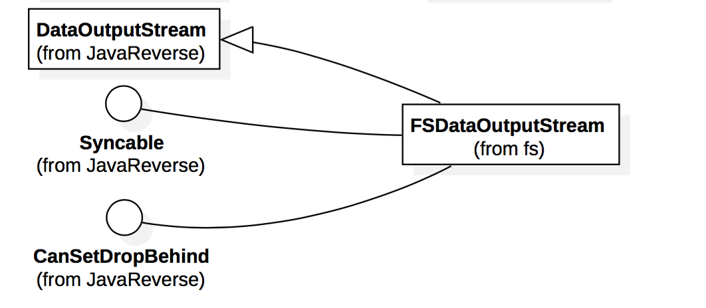

#hadoop源码分析
##FSDataOutputStream

FSDataOutputStream继承自DataOutputStream 并实现了接口Syncable和接口CanSetDropBehind，下面是对该类的具体说明：
	
三个构造函数：

该构造函数已过时

	  @Deprecated
	  public FSDataOutputStream(OutputStream out) throws IOException {
	    this(out, null);
	  }

该构造函数的参数包括：OutputStream类型的参数，Statistics类的参数		

	  public FSDataOutputStream(OutputStream out, FileSystem.Statistics stats)
	    throws IOException {
	    this(out, stats, 0);
	  }
	
该构造函数的参数包括：OutputStream类型的参数，Statistics类的参数和当前流的开始位置。
		
	  public FSDataOutputStream(OutputStream out, FileSystem.Statistics stats,
	                            long startPosition) throws IOException {
	    super(new PositionCache(out, stats, startPosition));
	    wrappedStream = out;
	  }
	
获取输入流的当前位置，并返回输入流的当前位置	  
	  
    public long getPos() throws IOException {
      return position;                            
      // return cached position
    }
    
	public long getPos() throws IOException {
	return ((PositionCache)out).getPos();
	}

关闭基础输入流

	public void close() throws IOException {
	  out.close(); // This invokes PositionCache.close()
	}

刷新客户端中用户缓冲区的数据。在此调用的返回之后，新的读者将看到数据。来自于接口：Syncable

  	public void hflush() throws IOException {
    	if (wrappedStream instanceof Syncable) {
      	((Syncable)wrappedStream).hflush();
    	} else {
      		wrappedStream.flush();
    	}
  	}

将客户端用户缓冲区中的数据一直刷新到磁盘设备（但磁盘可能在其缓存中）。来自于接口：Syncable

  	public void hsync() throws IOException {
    	if (wrappedStream instanceof Syncable) {
      	((Syncable)wrappedStream).hsync();
    	} else {
      		wrappedStream.flush();
    	}
  	}

配置判断流是否应该丢弃缓存。

参数：dropBehind：判断是否删除缓存

	public void setDropBehind(Boolean dropBehind) throws IOException {
	  try {
	    ((CanSetDropBehind)wrappedStream).setDropBehind(dropBehind);
	  } catch (ClassCastException e) {
	    throw new UnsupportedOperationException("the wrapped stream does " +
	        "not support setting the drop-behind caching setting.");
	  }
	}

###接口：Syncable

	@InterfaceAudience.Public
	@InterfaceStability.Evolving
	public interface Syncable {
	  /**
	   * @deprecated As of HADOOP 0.21.0, replaced by hflush
	   * @see #hflush()
	   */
	  @Deprecated  public void sync() throws IOException;
	  
	  /** Flush out the data in client's user buffer. After the return of
	   * this call, new readers will see the data.
	   * @throws IOException if any error occurs
	   */
	  public void hflush() throws IOException;
	  
	  /** Similar to posix fsync, flush out the data in client's user buffer 
	   * all the way to the disk device (but the disk may have it in its cache).
	   * @throws IOException if error occurs
	   */
	  public void hsync() throws IOException;
	}
	
###接口：	CanSetDropBehind

	@InterfaceAudience.Public
	@InterfaceStability.Evolving
	public interface CanSetDropBehind {
	  /**
	   * Configure whether the stream should drop the cache.
	   *
	   * @param dropCache     Whether to drop the cache.  null means to use the
	   *                      default value.
	   * @throws IOException  If there was an error changing the dropBehind
	   *                      setting.
	   *         UnsupportedOperationException  If this stream doesn't support
	   *                                        setting the drop-behind.
	   */
	  public void setDropBehind(Boolean dropCache) 
	      throws IOException, UnsupportedOperationException;
	}